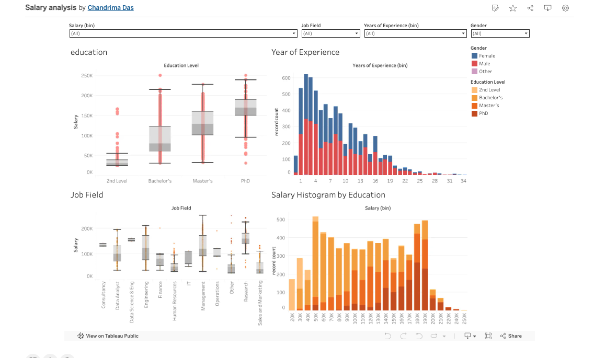

# PayLens

A salary data engineering pipeline and interactive analytics dashboard. Transforms a raw, inconsistent salary dataset into a clean, analysis-ready format, then visualises it across education, experience, job field, and gender dimensions.

---

## Overview

PayLens consists of two components:

1. **ETL Pipeline** — A Jupyter notebook that ingests raw salary data, applies five sequential cleaning and transformation stages, and outputs a clean CSV ready for analysis.
2. **Tableau Dashboard** — An interactive four-panel dashboard built on the cleaned data, with global filters for salary range, job field, experience, and gender.

The project demonstrates a full data engineering workflow: from messy source data to a stakeholder-ready visualisation.


---

## Repository Structure

```
paylens/
├── Salary_Data.csv               # Raw input data (6,704 records)
├── salary_data_cleaned.csv       # Pipeline output (6,695 records, 7 columns)
├── TRANSFORM.IPYNB               # ETL pipeline notebook
└── PAYLENS-TAB.png               # Dashboard screenshot
```

---

## Dataset

**Source:** `Salary_Data.csv`

| Column | Type | Notes |
|---|---|---|
| Age | Integer | Respondent age |
| Gender | String | Male, Female, Other |
| Education Level | String | Raw text, inconsistent formatting |
| Job Title | String | Free-text, unstandardised |
| Years of Experience | Numeric | Some records missing |
| Salary | Numeric | Mixed pay periods in some source datasets |

- Input rows: 6,704
- Output rows: 6,695 (9 removed: 5 null salary, 4 outliers)
- New column added: `Job Field` (engineered from `Job Title`)

---

## Pipeline

The notebook `TRANSFORM.IPYNB` runs five sequential stages through a single master function.

> **Suggested image:** A simple flow diagram showing the five stages in order (can be hand-drawn or built in any diagramming tool): Raw CSV → Deduplication → Imputation → Standardisation → Feature Engineering → Outlier Removal → Clean CSV.

### Stage 1: Fuzzy Duplicate Removal

Uses `fuzzywuzzy.fuzz.ratio()` (Levenshtein distance) to detect near-duplicate records. Rows are compared via a composite key: `Company|Job Title|Location|Salary`. Pairs scoring 90 or above are flagged; the second occurrence is removed.

On this dataset the guard condition (requiring Company and Location columns) is not met, so no records are removed. The function is built for reuse on richer datasets.

### Stage 2: Missing Value Imputation

Three strategies applied to three columns:

- **Years of Experience** — Median imputation. The median is used rather than the mean because experience data can be right-skewed.
- **Education Level** — Mode imputation. Correct strategy for categorical data where a numeric average has no meaning.
- **Salary** — Deletion. Records with no salary value are dropped. Salary is the target variable and cannot be meaningfully imputed.

Result: 6,704 → 6,699 records.

### Stage 3: Standardisation

Four functions normalise inconsistent text and numeric formats:

- `standardize_job_titles()` — Maps aliases to canonical titles (e.g. "SWE", "Software Eng" → "Software Engineer")
- `standardize_locations()` — Collapses geographic aliases (e.g. "SF", "San Fran" → "San Francisco")
- `standardize_companies()` — Handles rebrands and subsidiaries (e.g. "Facebook", "FB" → "Meta")
- `normalize_salary()` — Converts hourly and monthly figures to annual equivalents using heuristic thresholds (below $1,000 treated as hourly; $1,000–$15,000 treated as monthly)

### Stage 4: Feature Engineering

- `extract_years_experience()` — Parses experience from heterogeneous formats including plain integers, range strings ("3-5 years" → 4), and seniority labels ("senior" → 7)
- `standardize_education()` — Maps raw education strings to four canonical levels: 2nd Level, Bachelor's, Master's, PhD
- `categorize_job_field()` — Creates the `Job Field` column using keyword matching against eleven categories: Management, Research, Data Science & Eng, Engineering, Data Analyst, Finance, Sales and Marketing, Human Resources, IT, Operations, Consultancy

`Job Field` is the primary new analytical dimension produced by the pipeline.

### Stage 5: Outlier Removal

Applies the IQR method with a multiplier of 3 (conservative, to preserve legitimate high earners):

```
Lower bound = Q1 - 3 * IQR = -$200,000
Upper bound = Q3 + 3 * IQR =  $430,000
```

4 records removed (0.1% of data). Result: 6,699 → 6,695 records.

---

### Filters

| Filter | Dimension |
|---|---|
| Salary (bin) | Bucketed salary range |
| Job Field | Engineered category |
| Years of Experience (bin) | Bucketed experience range |
| Gender | Gender |

### Panels

**Education** — Box plot of salary distribution across four education levels. Higher education levels show higher median salaries and wider spreads. Gender is overlaid per group.

**Year of Experience** — Stacked histogram of record count by years of experience, coloured by education level. Distribution is right-skewed, peaking at years 1–4.

**Job Field** — Box plot of salary distribution across eleven job fields. Research and Management categories show the highest medians.

**Salary Histogram by Education** — Stacked histogram of record count across salary bins ($20K–$250K), coloured by education level. PhD representation increases at higher salary bands.

> **Suggested image:** The Salary Histogram by Education panel at full width, showing the full salary range and education level colour stack.

---

## Setup

### Requirements

```
Python 3.8+
pandas
numpy
fuzzywuzzy
scipy
```

### Installation

```bash
pip install pandas numpy fuzzywuzzy scipy
```

### Running the Pipeline

```bash
jupyter notebook TRANSFORM.IPYNB
```

Run all cells in order. The cleaned file is written to `salary_data_cleaned.csv` in the working directory.

---

## Known Issues

**FutureWarning on pandas fillna**  
Two lines use `.fillna(inplace=True)` on a chained assignment. This works in current pandas but will break in pandas 3.0. The correct form is:

```python
df['col'] = df['col'].fillna(value)
```

**Negative lower bound on outlier removal**  
The IQR calculation produces a lower bound of -$200,000. A salary cannot be negative, so a practical floor of `max(0, lower_bound)` should be applied in future versions.

**Fuzzy deduplication is O(n²)**  
The nested loop approach does not scale beyond roughly 50,000 rows without a blocking strategy to reduce comparisons.


---

## License

For portfolio and educational use.
